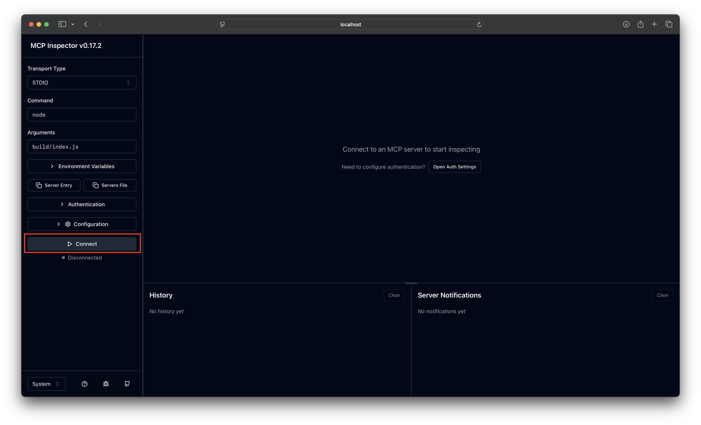
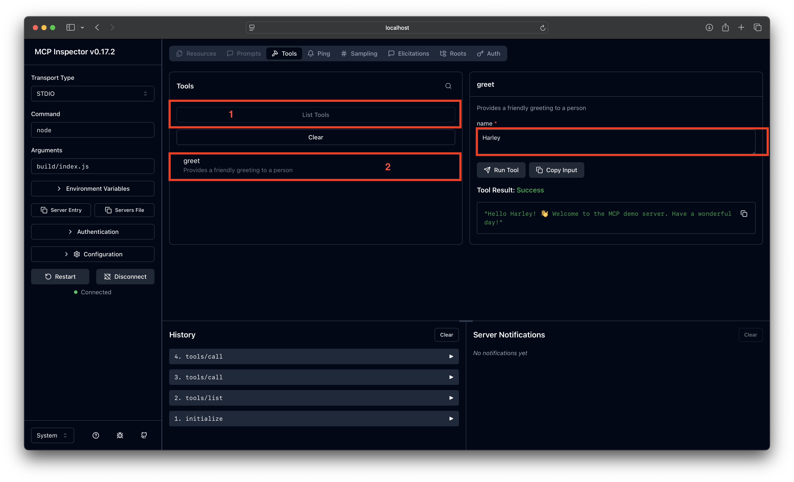
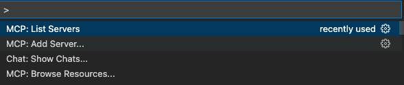
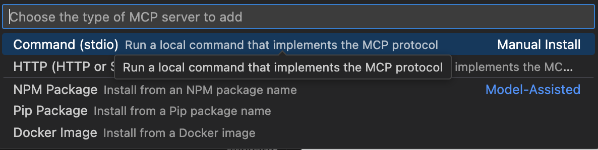

# Creating Servers

## Building Your Own MCP Server

In this lab, we'll build a custom MCP server that GitHub Copilot can interact with to retrieve information from NASA APIs. We'll use the TypeScript MCP SDK and Node.js to get up and running quickly. An MCP server acts as a bridge between Copilot and external services, enabling you to create custom tools, prompts, and resources.

While we're using TypeScript in this tutorial, you can find SDKs for other languages [here](https://github.com/modelcontextprotocol/servers?tab=readme-ov-file#model-context-protocol-servers).

## Choose Your IDE Path

Select the instructions for your development environment:
- [VS Code Instructions](#vs-code-instructions)
- [GitHub Codespaces Instructions](#github-codespaces-instructions)

---

## VS Code Instructions

### Requirements

- [Node.js](https://nodejs.org/en/learn/getting-started/introduction-to-nodejs) installed
- TypeScript (optional - included in the project dependencies)
- [NASA API Key](https://api.nasa.gov) (optional - you can use the demo key, but with reduced call limits)

### Instructions

1. **Set up the project**: Navigate to the `src` folder and run `npm install` to install dependencies. The `package.json` includes the [@modelcontextprotocol/sdk](https://github.com/modelcontextprotocol/typescript-sdk), TypeScript, and @types/node.

2. **Create your first tool**: Open the `index.ts` file. This is the foundation of your MCP server - it includes the SDK packages for Prompts, Tools, and Resources, the transport method for client connections, and basic server configuration.

   Use Copilot to create a simple tool by using this command in Copilot Chat:

   ```
   #fetch https://github.com/modelcontextprotocol/typescript-sdk

   Please add a tool to provide a friendly greeting
   ```

   This prompts Copilot to read the TypeScript SDK documentation and add a tool to your MCP server.

3. **Test your tool**: Now that you've added a tool, test it using the [MCP Inspector](https://modelcontextprotocol.io/docs/tools/inspector). First build the project, then launch the inspector:

   ```bash
   npm run build
   npx @modelcontextprotocol/inspector node build/index.js
   ```

   The Inspector will launch in a browser - from here select Connect, look at the list of tools for the one generated and then test it out.

  
  - Connect to MCP Inspector

  
  - Test using the Inspector

4. **Add external API integration**: Now we'll configure the server to call NASA's APOD (Astronomy Picture of the Day) API. Add this code below the import statements:

   ```typescript
   // Securely get NASA API key from environment variable
   const NASA_API_KEY = process.env.NASA_API_KEY || "DEMO_KEY";
   ```

   > **Note**: If you have your own NASA API Key, you can store it in a `.env` file for better security.

5. **Implement the NASA APOD tool**: You have two options for adding this functionality:

<details>
<summary>Option 1: Write the tool manually using SDK documentation</summary>

   **Reference Documentation:**
   - [TypeScript SDK Tools](https://github.com/modelcontextprotocol/typescript-sdk?tab=readme-ov-file#tools)
   - [NASA APIs](https://api.nasa.gov)

   a. **Define the tool schema**: The APOD API accepts optional parameters and requires an API key. Start by defining the tool's interface:

   ```typescript
   // NASA APOD (Astronomy Picture of the Day) Tool
   server.registerTool(
     "nasa-apod",
     {
       title: "NASA APOD",
       description:
         "Get NASA's Astronomy Picture of the Day (APOD) with optional parameters for specific dates, HD images, and more",
       inputSchema: {
         date: z
           .string()
           .optional()
           .describe(
             "Date of image to retrieve (YYYY-MM-DD format). Defaults to today's date. Cannot be before 1995-06-16."
           )
       },
     },
   ```

   b. **Implement the tool logic**: Add the async function that calls the NASA API with proper error handling:

   ```typescript
     async ({ date }) => {
       try {
         // Build the API URL
         const apiUrl = new URL("https://api.nasa.gov/planetary/apod");
         apiUrl.searchParams.set("api_key", NASA_API_KEY);

         // Add parameters if provided
         if (date) apiUrl.searchParams.set("date", date);

         // Make the API request
         const response = await fetch(apiUrl.toString());

         if (!response.ok) {
           throw new Error(
             `NASA API error: ${response.status} ${response.statusText}`
           );
         }

         const data = await response.text();
         return {
           content: [
             {
               type: "text",
               text: data,
             },
           ],
         };
       } catch (error) {
         const errorMessage =
           error instanceof Error ? error.message : "Unknown error occurred";
         return {
           content: [
             {
               type: "text",
               text: errorMessage,
             },
           ],
           isError: true,
         };
       }
     }
   );
   ```

   c. **Test the tool**: Build and launch the inspector to verify your tool works:
   ```bash
   npm run build && npx @modelcontextprotocol/inspector node build/index.js
   ```

   d. **Expected response**: You should see a JSON response similar to this:
   ```json
   {
     "date": "2025-07-16",
     "explanation": "Would the Rosette Nebula by any other name look as sweet?...",
     "hdurl": "https://apod.nasa.gov/apod/image/2507/Rosette_Decam_4000.jpg",
     "media_type": "image",
     "service_version": "v1",
     "title": "The Rosette Nebula from DECam",
     "url": "https://apod.nasa.gov/apod/image/2507/Rosette_Decam_960.jpg"
   }
   ```

</details>

<details>
<summary>Option 2: Use Copilot to generate the tool</summary>

   a. **Prompt Copilot**: In Copilot Chat (Agent mode), use this prompt:

   ```
   Add a tool to call the APOD API from NASA here: #fetch https://api.nasa.gov 
   AND leverage the TypeScript SDK: #fetch https://github.com/modelcontextprotocol/typescript-sdk?tab=readme-ov-file#tools
   ```

   This tells Copilot to fetch both the NASA API and TypeScript SDK documentation to generate the tool correctly.

   b. **Test the generated code**: Review the code Copilot created, then test it in the MCP Inspector:

   ```bash
   npm run build && npx @modelcontextprotocol/inspector node build/index.js
   ```

</details>

6. **Configure the server in VS Code**: Now that your server is working, connect it to Copilot:
   - Open the Command Palette (`Cmd+Shift+P` on macOS or `Ctrl+Shift+P` on Windows/Linux)
   - Select `MCP: Add Server`
   - Choose `Command (stdio)` for manual installation

   
   

7. **Enter the server command**: Add the command to run your server:

   ```
   node src/build/index.js
   ```

   Here, `node` is the command (since this is a Node.js project) and `src/build/index.js` is the path to your compiled server.

8. **Name your server**: Enter a meaningful name (e.g., `demo-server`) and press Enter. When prompted, choose **Workspace Settings** to make this server available only in the current workspace.

9. **Start the server**: Verify your server is configured correctly:
   - Open the Command Palette
   - Select `MCP: List Servers`
   - Find your `demo-server` in the list
   - Click to start it if it's not already running

   

10. **Test with Copilot**: Ask Copilot to retrieve an astronomy picture from a specific date! Try prompts like:
    - "Get today's NASA astronomy picture"
    - "Show me the NASA picture from July 16, 2025"

### Clean Up

If you want to remove your custom MCP server from your workspace:

1. **Stop the MCP Server**:
   - Open the Command Palette (`Cmd+Shift+P` on macOS or `Ctrl+Shift+P` on Windows/Linux)
   - Select `MCP: List Servers`
   - Find your server in the list and click **Stop** to disconnect the active connection

2. **Remove the Server Configuration**:
   - Delete the `.vscode/mcp.json` file from your workspace, OR
   - Remove your server entry from the `mcp.json` file if you want to keep other MCP servers configured

3. **Verify Removal**:
   - Open the Command Palette and run `MCP: List Servers` again
   - Your server should no longer appear in the list (or should show as not configured)
   - Test by asking Copilot about NASA pictures - it should no longer have access through your custom server

---

## GitHub Codespaces Instructions

> **Note**: The MCP Inspector tool does not work in GitHub Codespaces environments. To test your MCP server, you'll use a test client script instead.

### Requirements

- [Node.js](https://nodejs.org/en/learn/getting-started/introduction-to-nodejs) (pre-installed in Codespaces)
- TypeScript (optional - included in the project dependencies)
- [NASA API Key](https://api.nasa.gov) (optional - you can use the demo key, but with reduced call limits)

### Setup Instructions

1. **Set up the project**: Navigate to the `src` folder and run `npm install` to install dependencies. The `package.json` includes the [@modelcontextprotocol/sdk](https://github.com/modelcontextprotocol/typescript-sdk), TypeScript, and @types/node.

2. **Create your first tool**: Open the `index.ts` file. This is the foundation of your MCP server - it includes the SDK packages for Prompts, Tools, and Resources, the transport method for client connections, and basic server configuration.

   Use Copilot to create a simple tool by using this command in Copilot Chat:

   ```
   #fetch https://github.com/modelcontextprotocol/typescript-sdk

   Please add a tool to provide a friendly greeting
   ```

   This prompts Copilot to read the TypeScript SDK documentation and add a tool to your MCP server.

3. **Test your tool using the test client**: Navigate to `src/test-client.ts' and use Copilot Agent mode to do the following:

  ```
  Generate the client tests for the new tool
  ```

once Copilot completes the action, review the test and run `npm test` to validate the tests.

4. **Add external API integration**: Now we'll configure the server to call NASA's APOD (Astronomy Picture of the Day) API. Add this code below the import statements:

   ```typescript
   // Securely get NASA API key from environment variable
   const NASA_API_KEY = process.env.NASA_API_KEY || "DEMO_KEY";
   ```

   > **Note**: If you have your own NASA API Key, you can store it in a `.env` file for better security.

5. **Implement the NASA APOD tool**: You have two options for adding this functionality:

<details>
<summary>Option 1: Write the tool manually using SDK documentation</summary>

   **Reference Documentation:**
   - [TypeScript SDK Tools](https://github.com/modelcontextprotocol/typescript-sdk?tab=readme-ov-file#tools)
   - [NASA APIs](https://api.nasa.gov)

   a. **Define the tool schema**: The APOD API accepts optional parameters and requires an API key. Start by defining the tool's interface:

   ```typescript
   // NASA APOD (Astronomy Picture of the Day) Tool
   server.registerTool(
     "nasa-apod",
     {
       title: "NASA APOD",
       description:
         "Get NASA's Astronomy Picture of the Day (APOD) with optional parameters for specific dates, HD images, and more",
       inputSchema: {
         date: z
           .string()
           .optional()
           .describe(
             "Date of image to retrieve (YYYY-MM-DD format). Defaults to today's date. Cannot be before 1995-06-16."
           )
       },
     },
   ```

   b. **Implement the tool logic**: Add the async function that calls the NASA API with proper error handling:

   ```typescript
     async ({ date }) => {
       try {
         // Build the API URL
         const apiUrl = new URL("https://api.nasa.gov/planetary/apod");
         apiUrl.searchParams.set("api_key", NASA_API_KEY);

         // Add parameters if provided
         if (date) apiUrl.searchParams.set("date", date);

         // Make the API request
         const response = await fetch(apiUrl.toString());

         if (!response.ok) {
           throw new Error(
             `NASA API error: ${response.status} ${response.statusText}`
           );
         }

         const data = await response.text();
         return {
           content: [
             {
               type: "text",
               text: data,
             },
           ],
         };
       } catch (error) {
         const errorMessage =
           error instanceof Error ? error.message : "Unknown error occurred";
         return {
           content: [
             {
               type: "text",
               text: errorMessage,
             },
           ],
           isError: true,
         };
       }
     }
   );
   ```

   c. **Test the tool using the test client**: Navigate to `src/test-client.ts` and use Copilot Agent mode to generate tests for the NASA APOD tool:

   ```
   Generate the client tests for the nasa-apod tool
   ```

   Once Copilot completes the action, review the test and run `npm test` to validate the tests. You should see a JSON response similar to this:

   ```json
   {
     "date": "2025-07-16",
     "explanation": "Would the Rosette Nebula by any other name look as sweet?...",
     "hdurl": "https://apod.nasa.gov/apod/image/2507/Rosette_Decam_4000.jpg",
     "media_type": "image",
     "service_version": "v1",
     "title": "The Rosette Nebula from DECam",
     "url": "https://apod.nasa.gov/apod/image/2507/Rosette_Decam_960.jpg"
   }
   ```

</details>

<details>
<summary>Option 2: Use Copilot to generate the tool</summary>

   a. **Prompt Copilot**: In Copilot Chat (Agent mode), use this prompt:

   ```
   Add a tool to call the APOD API from NASA here: #fetch https://api.nasa.gov 
   AND leverage the TypeScript SDK: #fetch https://github.com/modelcontextprotocol/typescript-sdk?tab=readme-ov-file#tools
   ```

   This tells Copilot to fetch both the NASA API and TypeScript SDK documentation to generate the tool correctly.

   b. **Test the generated code using the test client**: Navigate to `src/test-client.ts` and use Copilot Agent mode to generate tests:

   ```
   Generate the client tests for the nasa-apod tool
   ```

   Once Copilot completes the action, review the test and run `npm test` to validate the tests.

</details>

6. **Configure the server in Codespace**: Now that your server is working, connect it to Copilot:
   - Open the Command Palette (`Cmd+Shift+P` on macOS or `Ctrl+Shift+P` on Windows/Linux)
   - Select `MCP: Add Server`
   - Choose `Command (stdio)` for manual installation

7. **Enter the server command**: Add the command to run your server:

   ```
   node src/build/index.js
   ```

   Here, `node` is the command (since this is a Node.js project) and `src/build/index.js` is the path to your compiled server. 

8. **Name your server**: Enter a meaningful name (e.g., `demo-server`) and press Enter. When prompted, choose **Workspace Settings** to make this server available only in the current workspace.

9. **Start the server**: Verify your server is configured correctly:
   - Open the Command Palette
   - Select `MCP: List Servers`
   - Find your `demo-server` in the list
   - Click to start it if it's not already running

10. **Test with Copilot**: Ask Copilot to retrieve an astronomy picture from a specific date! Try prompts like:
    - "Get today's NASA astronomy picture"
    - "Show me the NASA picture from July 16, 2025"

### Clean Up

If you want to remove your custom MCP server from your workspace:

1. **Stop the MCP Server**:
   - Open the Command Palette (`Cmd+Shift+P` on macOS or `Ctrl+Shift+P` on Windows/Linux)
   - Select `MCP: List Servers`
   - Find your server in the list and click **Stop** to disconnect the active connection

2. **Remove the Server Configuration**:
   - Delete the `.vscode/mcp.json` file from your workspace, OR
   - Remove your server entry from the `mcp.json` file if you want to keep other MCP servers configured

3. **Verify Removal**:
   - Open the Command Palette and run `MCP: List Servers` again
   - Your server should no longer appear in the list (or should show as not configured)
   - Test by asking Copilot about NASA pictures - it should no longer have access through your custom server

## Next Steps

Now that you've built a custom MCP server, explore more possibilities:
- Add prompts and resources to your server (see the [TypeScript SDK documentation](https://github.com/modelcontextprotocol/typescript-sdk))
- Enhance the tool to display images directly using the returned URL
- Integrate additional NASA APIs or other external services
- Share your server with your team or publish it for others to use
- Explore other [community-built MCP servers](https://github.com/modelcontextprotocol/servers) for inspiration