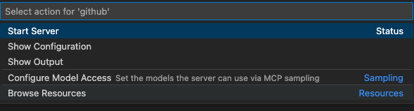
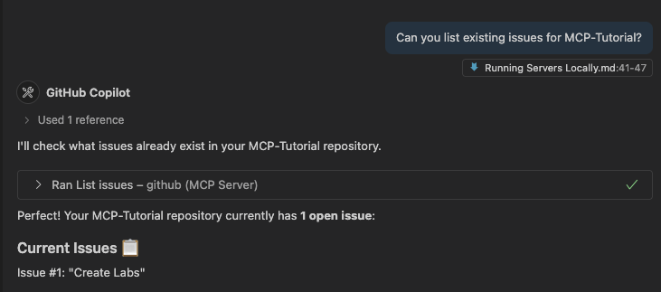

# Running Servers Locally

## Using MCP Servers

MCP Servers are officially hosted by third parties to provide tools for users to engage with their services. These tools can engage Databases, API's, Third party websites and other services. Today we're going to install the GitHub Offical MCP Server locally so that Copilot can use the provided tools to review repositories. 

While GitHub offers a lot of built-in functionality with Copilot, the MCP server we're introducing adds additional capabilities - particularly around creating and reviewing branches and issues in your personal repositories (including accessing the private ones). If you'd prefer not to give the GitHub MCP Server access to your current repos, it might be worth setting up a dedicated repository specifically for Copilot to use.

## Instructions

1. To start - in this project (or any local repo) create a `.vscode/mcp.json` file. This file is where you can add servers to be used in the context of your local repo or workspace.

2. In your `mcp.json` file, paste the following code:

```
{
  "servers": {
    "github": {
      "type": "http",
      "url": "https://api.githubcopilot.com/mcp/"
    }
  }
}
```

This sets up a basic server call from your workspace to the GitHub MCP Server. This is the config for VS Code (the client) to connect to the MCP Server. Server configuration and required inputs vary from server to server - and in this case to support the VSCode integration you'll be prompted to allow VSCode to access your GitHub account. *Please note doing this will grant total access to all your repos - including the private ones.*

There is an option to set up a Personal Access Token which can be used to limit access, if this is preferable. To do this, see step 3 OR go straight to step 4.

3. OPTIONAL: Next step is to [Generate a Personal Access Token (PAT)](https://docs.github.com/en/authentication/keeping-your-account-and-data-secure/managing-your-personal-access-tokens#creating-a-fine-grained-personal-access-token). By using a Fine Grained access token, you can specify which repos you want to grant Copilot access. Once the PAT is generated, copy it for the next step.

4. Go to the Command Palette and select `Show and Run Commands >` and select `MCP: List Servers` to see a list of active servers you can use locally or globally. From here you will see the GitHub server and can start the connection. If you decided to use a PAT, then the first time you run the server you'll be prompted to enter the PAT generated in step 3. Else you'll be directed to permit access via OAuth.




5. Now to test the service! Using Copilot Chat in Agent mode, try and ask a specific question relating to your repositories!



*Please note that if you try and access any resources that you didn't give your permission to, Copilot won't be able to retrieve that info.*

## Next Steps

Now you've successfully integrated this MCP server, you can keep going to find more MCP servers that are relevant! Try out [these](https://github.com/modelcontextprotocol/servers) OR search for any that could be relevant for you!