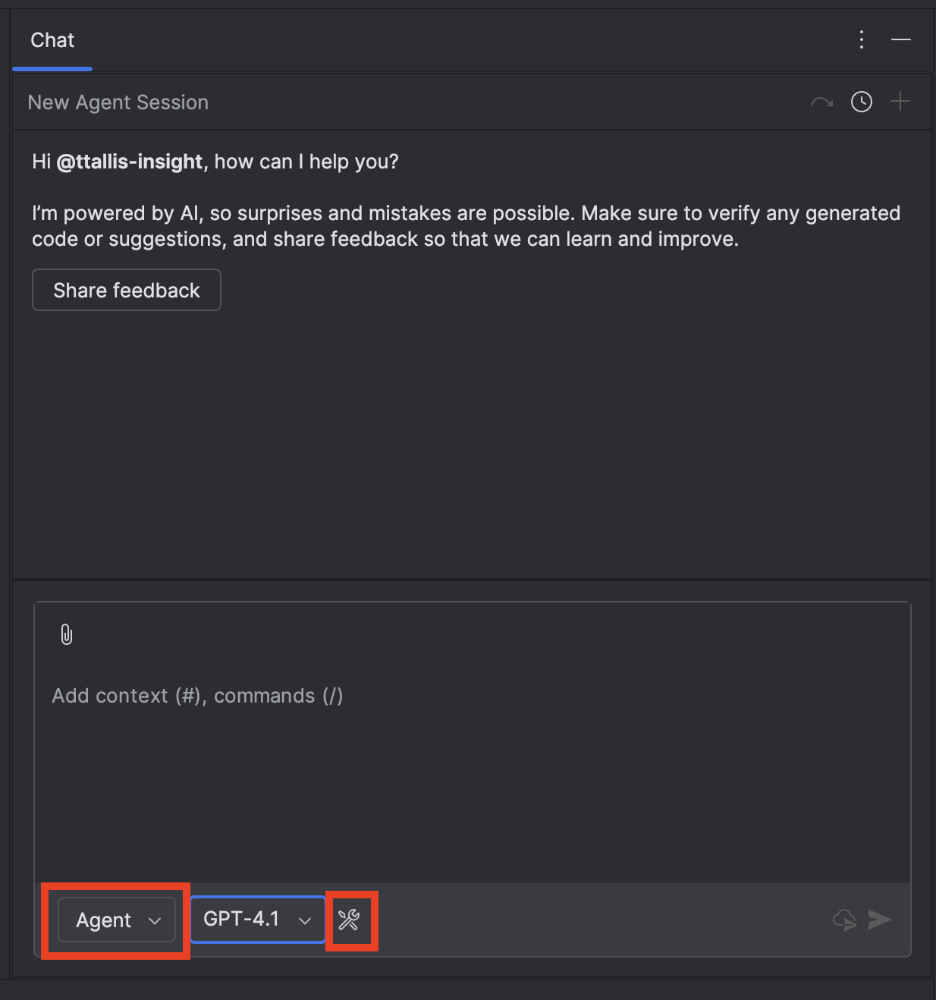

# Running Servers Locally

## Using MCP Servers

MCP Servers are officially hosted by third parties to provide tools for users to engage with their services. These tools can engage Databases, APIs, Third party websites and other services. Today we're going to install the GitHub Official MCP Server locally so that Copilot can use the provided tools to review repositories. 

While GitHub offers a lot of built-in functionality with Copilot, the MCP server adds additional capabilities - particularly around creating and reviewing branches and issues in your personal repositories (including accessing the private ones). If you'd prefer not to give the GitHub MCP Server access to your current repos, it might be worth setting up a dedicated repository specifically for Copilot to use.

## Choose Your IDE Path

Please note that presently we have instructions for VS Code and IntelliJ. If you don't have access to either of these please use GitHub Codespace and follow the VS Code instructions.

> **Note**: The IntelliJ instructions in this lab demonstrate using a global configuration with a Personal Access Token for enhanced security and control. IntelliJ also supports OAuth authentication if preferred.

Select the instructions for your development environment:
- [VS Code Instructions](#vs-code-instructions)
- [IntelliJ Instructions](#intellij-instructions)

---

## VS Code Instructions

### Setup

1. **Create the MCP configuration file**: In this project (or any local repo), create a `.vscode/mcp.json` file. This file is where you can add servers to be used in the context of your local repo or workspace.

2. **Add the GitHub server configuration**: In your `mcp.json` file, paste the following code:

```json
{
  "servers": {
    "github": {
      "type": "http",
      "url": "https://api.githubcopilot.com/mcp/",
      "headers": {
        "Authorization": "Bearer ${input:github_mcp_pat}"
      }
    }
  },
  "inputs": [
    {
      "type": "promptString",
      "id": "github_mcp_pat",
      "description": "GitHub Personal Access Token",
      "password": true
    }
  ]
}
```

This sets up a basic server call from your workspace to the GitHub MCP Server. This is the config for VS Code (the client) to connect to the MCP Server. Server configuration and required inputs vary from server to server - and in this case to support the VS Code integration you'll be prompted to allow VS Code to access your GitHub account. 

3. **Generate a Personal Access Token**: [Generate a Personal Access Token (PAT)](https://docs.github.com/en/authentication/keeping-your-account-and-data-secure/managing-your-personal-access-tokens#creating-a-fine-grained-personal-access-token). In order for the MCP Server to access specific information about your GitHub Repositories, you need to provide access via a Personalized Access Token (PAT). Please only provide limited permissions to the token for this exercise.

4. **Connect to the GitHub MCP Server**: Go to the Command Palette and select `Show and Run Commands >` and select `MCP: List Servers` to see a list of active servers you can use locally or globally. From here you will see the GitHub server and can start the connection. You will need to enter the PAT generated in the prior step.


5. **Test the service**: Using Copilot Chat in Agent mode, ask a specific question relating to your repositories!


> **Note**: If you try to access any resources that you didn't give permission to, Copilot won't be able to retrieve that information.

### Clean Up

If you want to remove the GitHub MCP Server connection from your workspace, follow these steps:

1. **Stop the MCP Server**: 
   - Open the Command Palette (`Cmd+Shift+P` on macOS or `Ctrl+Shift+P` on Windows/Linux)
   - Select `MCP: List Servers`
   - Find the GitHub server in the list and click **Stop** to disconnect the active connection

2. **Remove Authentication**:
   - In the same `MCP: List Servers` view, find the GitHub server
   - In the `.vscode/mcp.json` file you can remove the stored PAT by hovering over the obfuscated text and selecting the 'Clear' or 'Clear all' option.
   - Revoke the PAT by going to the following site: **GitHub Settings > Developer settings > Personal access tokens > Fine-grained tokens**

3. **Remove the Server Configuration**:
   - Delete the `.vscode/mcp.json` file from your workspace, OR
   - Remove the GitHub server entry from the `mcp.json` file if you want to keep other MCP servers configured

4. **Verify Removal**:
   - Open the Command Palette and run `MCP: List Servers` again
   - The GitHub server should no longer appear in the list (or should show as not configured)
   - Test by asking Copilot a question about your repositories - it should no longer have access through the MCP server

---

## IntelliJ Instructions

### Setup

1. **Generate a Personal Access Token**: [Generate a Personal Access Token (PAT)](https://docs.github.com/en/authentication/keeping-your-account-and-data-secure/managing-your-personal-access-tokens#creating-a-fine-grained-personal-access-token). In order for the MCP Server to access specific information about your GitHub Repositories, you need to provide access via a Personalized Access Token (PAT). Please only provide limited permissions to the token for this exercise.

2. **Open Copilot Chat in IntelliJ**: After opening the chat you need to change the mode to 'Agent' and select the 'tools' icon. A window will open up to configure tools, and at the bottom is a link to 'Add More Tools'.



3. **Update the MCP configuration**: The `mcp.json` config file that opens is the **global** config file for IntelliJ. Update the file so that the github server configuration is present:

```json
{
  "servers": {
    "github": {
      "type": "http",
      "url": "https://api.githubcopilot.com/mcp/",
      "headers": {
        "Authorization": "Bearer ${input:MCP_PAT}"
      }
    }
  }
}
```

4. **Add the PAT for Authentication**: Go to `Settings > Tools > GitHub Copilot > Model Context Protocol` and you will see an input field for `GitHub MCP PAT`. Enter the PAT here and it will be securely stored.

> **Note**: If you try to access any resources that you didn't give permission to through your PAT scopes, Copilot won't be able to retrieve that information.

5. **Test**: Ask Copilot Chat for relevant information about your GitHub account to validate it all went smoothly. You will be prompted for consent before Copilot uses any tool related to the new MCP server.

### Clean Up

If you want to remove the GitHub MCP Server connection from your workspace, follow these steps:

1. **Remove the Server Configuration**:
   - Remove the GitHub server entry from the `mcp.json` file.

2. **Revoke the Personal Access Token**:
   - Go to **GitHub Settings > Developer settings > Personal access tokens > Fine-grained tokens**
   - Find the token you created for the MCP server.
   - Click **Revoke** to permanently remove access.

3. **Restart IntelliJ**: Restart IntelliJ IDEA to ensure the MCP server is no longer loaded.

4. **Verify Removal**:
   - Open Copilot Chat and test by asking a question about your repositories
   - It should no longer have access through the MCP server

---

## Next Steps

Now you've successfully integrated this MCP server, you can keep going to find more MCP servers that are relevant! Remember - only use MCP servers that you trust from verified authors.